# Claude Code Project Bootstrap

## Overview

Set up a complete Claude Code project from scratch — GitHub repo, README, hooks, file protection, build-gated commits, secret scanning, auto-formatting, and git workflow conventions. Works for any stack.

## When to Use

- Starting a new project that will use Claude Code
- Adding guardrails to an existing project
- User asks about protecting files, blocking commands, or enforcing builds
- User wants to replicate hooks/workflow from another project
- User wants to create a GitHub repo for a project

## Bootstrap Flow

```dot
digraph bootstrap {
  rankdir=LR;
  "Has git repo?" [shape=diamond];
  "Init git + GitHub repo" [shape=box];
  "Has README?" [shape=diamond];
  "Generate README" [shape=box];
  "Create hooks + settings" [shape=box];
  "Write CLAUDE.md" [shape=box];
  "Initial commit + push" [shape=box];

  "Has git repo?" -> "Init git + GitHub repo" [label="no"];
  "Has git repo?" -> "Has README?" [label="yes"];
  "Init git + GitHub repo" -> "Has README?";
  "Has README?" -> "Generate README" [label="no"];
  "Has README?" -> "Create hooks + settings" [label="yes"];
  "Generate README" -> "Create hooks + settings";
  "Create hooks + settings" -> "Write CLAUDE.md";
  "Write CLAUDE.md" -> "Initial commit + push";
}
```



## Step 1: Git + GitHub Repo

Skip if the project already has a git repo and remote.

### New repo from existing directory

```bash
cd your-project
git init
```

### Create GitHub repo

Ask the user for visibility preference (public/private). Default to private.

```bash
# Private (default)
gh repo create <repo-name> --private --source=. --push

# Public
gh repo create <repo-name> --public --source=. --push

# With description
gh repo create <repo-name> --private --source=. --push --description "Short project description"
```

**If the directory is empty (brand new project):**
```bash
mkdir <project-name> && cd <project-name>
git init
gh repo create <repo-name> --private --source=. --push
```

### .gitignore

If no `.gitignore` exists, create one appropriate for the stack. Always include:

```gitignore
# Claude Code (user-specific, not shared)
.claude/settings.local.json

# Secrets
.env
.env.*
*.key
*.pem

# OS
.DS_Store
Thumbs.db
```

Add stack-specific entries (node_modules, __pycache__, target/, build/, etc.).

## Step 2: README

If no `README.md` exists, generate one. Ask the user for project context or infer from existing files.

````markdown
# Project Name

Brief description of what this project does.

## Getting Started

### Prerequisites
- List dependencies and tools needed

### Installation
```
# Installation commands
```

### Development
```
# How to run locally
```

### Testing
```
# How to run tests
```

## Project Structure

```
overview of key directories and files
```

## Contributing

This project uses [Claude Code](https://claude.ai/claude-code) with automated guardrails:
- Destructive git commands are blocked (force push, reset --hard, etc.)
- Commits are gated behind passing builds and tests
- Sensitive files (.env, credentials) are protected from accidental writes
- Conventional commits enforced: `<type>(<scope>): <subject>`
- Secrets are scanned on every file write
- Code is auto-formatted on save (if formatters are installed)

See `CLAUDE.md` for full development workflow.

## License

[Choose appropriate license]
````

**Adapt the README** to the actual project — don't use the template verbatim. Fill in real values from the codebase, package.json, Cargo.toml, go.mod, etc.

## Step 3: Directory Structure

```
your-project/
├── .claude/
│   ├── hooks/
│   │   ├── validate-bash.sh      # blocks destructive commands, gates commits
│   │   ├── protect-files.sh      # blocks writes to sensitive files
│   │   ├── build-check.sh        # auto-detects stack, runs build + tests
│   │   ├── scan-secrets.sh       # warns on hardcoded secrets in written files
│   │   ├── session-check.sh      # verifies hooks setup on session start
│   │   └── auto-format.sh        # formats files after write (if formatters installed)
│   ├── settings.json             # hook wiring (committed to git)
│   └── settings.local.json       # user allow-list (NOT committed)
├── .gitignore
├── README.md
└── CLAUDE.md                      # project instructions
```

## Step 4: Hook System

Hooks are shell scripts triggered by Claude Code's tool lifecycle. They read JSON from stdin and control execution via exit codes:

| Exit | Meaning |
|------|---------|
| `0` | Allow |
| `1` | Soft block (retry possible) |
| `2` | Hard block (denied) |

### settings.json (commit this)

```json
{
  "hooks": {
    "PreToolUse": [
      {
        "matcher": "Bash",
        "hooks": [{"type": "command", "command": "\"$CLAUDE_PROJECT_DIR\"/.claude/hooks/validate-bash.sh", "timeout": 10}]
      },
      {
        "matcher": "Write|Edit",
        "hooks": [{"type": "command", "command": "\"$CLAUDE_PROJECT_DIR\"/.claude/hooks/protect-files.sh", "timeout": 10}]
      }
    ],
    "PostToolUse": [
      {
        "matcher": "Write|Edit",
        "hooks": [
          {"type": "command", "command": "\"$CLAUDE_PROJECT_DIR\"/.claude/hooks/scan-secrets.sh", "timeout": 10},
          {"type": "command", "command": "\"$CLAUDE_PROJECT_DIR\"/.claude/hooks/auto-format.sh", "timeout": 15}
        ]
      }
    ],
    "SessionStart": [
      {
        "hooks": [{"type": "command", "command": "\"$CLAUDE_PROJECT_DIR\"/.claude/hooks/session-check.sh", "timeout": 5}]
      }
    ]
  }
}
```

### validate-bash.sh

Blocks destructive commands, validates commits and branches, gates commits behind passing builds.

```bash
#!/bin/bash
INPUT=$(cat)
COMMAND=$(echo "$INPUT" | jq -r '.tool_input.command // empty')
[ -z "$COMMAND" ] && exit 0

# === Universal blocks (with helpful alternatives) ===
if echo "$COMMAND" | grep -qE 'rm\s+(-rf|--recursive\s+--force)'; then
  echo "BLOCKED: recursive forced deletion is not allowed. Use 'git clean -n' to preview, or remove specific files individually." >&2
  exit 2
fi
if echo "$COMMAND" | grep -qE 'git\s+push\s+(-f|--force)'; then
  echo "BLOCKED: force push is not allowed. Use 'git push --force-with-lease' if you must overwrite, or better: create a new commit." >&2
  exit 2
fi
if echo "$COMMAND" | grep -qE 'git\s+reset\s+--hard'; then
  echo "BLOCKED: hard reset discards all changes permanently. Use 'git stash' to save work, or 'git reset --soft' to keep changes staged." >&2
  exit 2
fi
if echo "$COMMAND" | grep -qE 'git\s+checkout\s+(main|master)(\s|$)'; then
  echo "BLOCKED: checking out main directly is not allowed. Use: git checkout -b <branch-name> origin/main" >&2
  exit 2
fi
if echo "$COMMAND" | grep -qE 'git\s+clean\s+-f'; then
  echo "BLOCKED: clean with force flag permanently deletes untracked files. Use 'git clean -n' to preview what would be deleted first." >&2
  exit 2
fi

# === Bash file-write protection ===
# Extends protect-files.sh coverage to Bash commands (cp, mv, tee, redirects)
# that bypass the Write/Edit tool hooks.

check_path() {
  local TARGET="$1"
  [ -z "$TARGET" ] && return 0

  # Resolve relative paths
  [[ "$TARGET" != /* ]] && TARGET="$CLAUDE_PROJECT_DIR/$TARGET"

  # Allow Claude memory
  [[ "$TARGET" == "$HOME/.claude/"* ]] && return 0

  # Block sensitive directories
  for SENSITIVE_DIR in "$HOME/.ssh" "$HOME/.aws" "$HOME/.gnupg" "$HOME/.config/gh"; do
    if [[ "$TARGET" == "$SENSITIVE_DIR"* ]]; then
      echo "BLOCKED: '$TARGET' is in a sensitive directory ($SENSITIVE_DIR). Do not read or write credentials." >&2
      exit 2
    fi
  done

  # Block outside project
  [[ "$TARGET" != "$CLAUDE_PROJECT_DIR"* ]] && echo "BLOCKED: '$TARGET' is outside the project directory. Use Write/Edit tool for in-project files, or ask the user." >&2 && exit 2

  # Block secrets by filename
  local BASENAME
  BASENAME=$(basename "$TARGET")
  case "$BASENAME" in
    .env|.env.local|.env.production|.env.staging|.env.development) echo "BLOCKED: cannot write to env file '$BASENAME' via Bash." >&2; exit 2;;
    credentials.json|secrets.json|secrets.yaml) echo "BLOCKED: cannot write to credentials file '$BASENAME' via Bash." >&2; exit 2;;
    *.key|*.pem|*.p12|*.pfx) echo "BLOCKED: cannot write to key/cert file '$BASENAME' via Bash." >&2; exit 2;;
  esac

  return 0
}

# Check cp/mv destination (last argument)
if echo "$COMMAND" | grep -qE '^\s*(cp|mv)\s'; then
  DEST=$(echo "$COMMAND" | awk '{print $NF}')
  check_path "$DEST"
fi

# Check tee target
if echo "$COMMAND" | grep -qE '\btee\s'; then
  TEE_TARGET=$(echo "$COMMAND" | sed -n 's/.*tee\s\+\(-a\s\+\)\?\([^ |;>&]*\).*/\2/p')
  check_path "$TEE_TARGET"
fi

# Check output redirects (> and >>)
if echo "$COMMAND" | grep -qE '>\s*/|>\s*~'; then
  REDIR_TARGET=$(echo "$COMMAND" | grep -oE '>{1,2}\s*[^ ;|&]+' | tail -1 | sed 's/>{1,2}\s*//')
  check_path "$REDIR_TARGET"
fi

# === Branch name validation ===
if echo "$COMMAND" | grep -qE 'git\s+checkout\s+-b\s+'; then
  BRANCH_NAME=$(echo "$COMMAND" | sed -n 's/.*git checkout -b \([^ ]*\).*/\1/p')
  if [ -n "$BRANCH_NAME" ] && ! echo "$BRANCH_NAME" | grep -qE '^(feature|fix|test|refactor|docs|chore|perf)/'; then
    echo "BLOCKED: branch name '$BRANCH_NAME' does not follow convention. Use one of: feature/, fix/, test/, refactor/, docs/, chore/, perf/" >&2
    exit 2
  fi
fi

# === Pre-commit gates ===
if echo "$COMMAND" | grep -qE 'git\s+commit'; then

  # Build gate
  "$CLAUDE_PROJECT_DIR"/.claude/hooks/build-check.sh || { echo "BLOCKED: build or tests failed — fix before committing." >&2; exit 2; }

  # Commit message validation
  COMMIT_MSG=$(echo "$COMMAND" | sed -n "s/.*-m[[:space:]]*[\"']\([^\"']*\)[\"'].*/\1/p")
  if [ -n "$COMMIT_MSG" ]; then
    if ! echo "$COMMIT_MSG" | grep -qE '^(feat|fix|test|docs|refactor|chore|perf|ci)(\(.+\))?: .+'; then
      echo "BLOCKED: commit message does not follow conventional format." >&2
      echo "  Expected: <type>(<scope>): <subject>" >&2
      echo "  Types: feat, fix, test, docs, refactor, chore, perf, ci" >&2
      echo "  Example: feat(auth): add login endpoint" >&2
      exit 2
    fi
  fi

  # Diff size warning — non-blocking
  DIFF_STAT=$(git diff --cached --shortstat 2>/dev/null)
  if [ -n "$DIFF_STAT" ]; then
    FILE_COUNT=$(echo "$DIFF_STAT" | grep -oE '[0-9]+ file' | grep -oE '[0-9]+')
    LINE_CHANGES=$(echo "$DIFF_STAT" | grep -oE '[0-9]+ insertion' | grep -oE '[0-9]+')
    LINE_DELETIONS=$(echo "$DIFF_STAT" | grep -oE '[0-9]+ deletion' | grep -oE '[0-9]+')
    TOTAL_LINES=$(( ${LINE_CHANGES:-0} + ${LINE_DELETIONS:-0} ))
    if [ "${FILE_COUNT:-0}" -gt 30 ] || [ "$TOTAL_LINES" -gt 1000 ]; then
      echo "WARNING: Large commit detected — $DIFF_STAT. Consider splitting into smaller commits." >&2
    fi
  fi

  # Success feedback
  echo "All pre-commit checks passed: build OK, message valid, ready to commit."
fi

# Post-merge reminder (non-blocking)
if echo "$COMMAND" | grep -qE 'gh\s+pr\s+merge'; then
  echo "REMINDER: fetch origin main → new branch → delete old branch"
fi

exit 0
```

### protect-files.sh

Blocks writes to secrets, credentials, and files outside the project.

```bash
#!/bin/bash
INPUT=$(cat)
FILE_PATH=$(echo "$INPUT" | jq -r '.tool_input.file_path // empty')
[ -z "$FILE_PATH" ] && exit 0

# Allow Claude memory
[[ "$FILE_PATH" == "$HOME/.claude/"* ]] && exit 0

# Block outside project
[[ "$FILE_PATH" != "$CLAUDE_PROJECT_DIR"* ]] && echo "BLOCKED: outside project" >&2 && exit 2

# Block secrets
BASENAME=$(basename "$FILE_PATH")
case "$BASENAME" in
  .env|.env.local|.env.production|.env.staging|.env.development) echo "BLOCKED: env file" >&2; exit 2;;
  credentials.json|secrets.json|secrets.yaml) echo "BLOCKED: credentials" >&2; exit 2;;
  *.key|*.pem|*.p12|*.pfx) echo "BLOCKED: key/cert file" >&2; exit 2;;
esac

# Stack-specific (uncomment what applies):
# [[ "$FILE_PATH" == *".xcodeproj/project.pbxproj" ]] && echo "BLOCKED: pbxproj" >&2 && exit 2
# [[ "$BASENAME" == "package-lock.json" ]] && echo "BLOCKED: lock file" >&2 && exit 2
# [[ "$BASENAME" == *.tfstate* ]] && echo "BLOCKED: tfstate" >&2 && exit 2

exit 0
```

### build-check.sh

Auto-detects the project stack and runs the appropriate build and test commands.

```bash
#!/bin/bash
cd "$CLAUDE_PROJECT_DIR"

# === Auto-detect build system and run build + tests ===

# Node/TypeScript
if [ -f "package.json" ]; then
  echo "Detected: Node/TypeScript project"
  if grep -q '"build"' package.json 2>/dev/null; then
    npm run build || exit 1
    echo "Build passed."
  fi
  if grep -q '"test"' package.json 2>/dev/null; then
    if [ -d "test" ] || [ -d "tests" ] || [ -d "__tests__" ] || find . -maxdepth 3 -name "*.test.*" -o -name "*.spec.*" 2>/dev/null | grep -q .; then
      npm test || exit 1
      echo "Tests passed."
    fi
  fi
  exit 0
fi

# Rust
if [ -f "Cargo.toml" ]; then
  echo "Detected: Rust project"
  cargo build || exit 1
  echo "Build passed."
  cargo test || exit 1
  echo "Tests passed."
  exit 0
fi

# Go
if [ -f "go.mod" ]; then
  echo "Detected: Go project"
  go build ./... || exit 1
  echo "Build passed."
  if find . -name "*_test.go" -not -path "./.git/*" 2>/dev/null | grep -q .; then
    go test ./... || exit 1
    echo "Tests passed."
  fi
  exit 0
fi

# Python
if [ -f "pyproject.toml" ] || [ -f "setup.py" ] || [ -f "setup.cfg" ]; then
  echo "Detected: Python project"
  find . -name "*.py" -not -path "./.venv/*" -not -path "./venv/*" -not -path "./.git/*" | head -50 | xargs python -m py_compile 2>/dev/null || exit 1
  echo "Build (compile check) passed."
  if [ -d "tests" ] || [ -d "test" ] || find . -name "test_*.py" -not -path "./.venv/*" 2>/dev/null | grep -q .; then
    if command -v pytest >/dev/null 2>&1; then
      pytest --tb=short -q || exit 1
      echo "Tests passed."
    fi
  fi
  exit 0
fi

# Xcode (Swift/iOS/visionOS/macOS)
if ls *.xcodeproj >/dev/null 2>&1 || ls *.xcworkspace >/dev/null 2>&1; then
  echo "Detected: Xcode project"
  SCHEME=$(ls -d *.xcodeproj 2>/dev/null | head -1 | sed 's/.xcodeproj//')
  if [ -n "$SCHEME" ]; then
    xcodebuild build -scheme "$SCHEME" -quiet 2>&1 | tail -5 || exit 1
    echo "Build passed."
    # Note: xcodebuild test requires a -destination flag specific to the project.
    # Add it to CLAUDE.md Change Protocol instead.
  fi
  exit 0
fi

echo "No build system detected — skipping."
exit 0
```

### scan-secrets.sh

Scans written files for hardcoded secrets. Non-blocking (always exits 0).

```bash
#!/bin/bash
INPUT=$(cat)
FILE_PATH=$(echo "$INPUT" | jq -r '.tool_input.file_path // empty')
[ -z "$FILE_PATH" ] && exit 0
[ ! -f "$FILE_PATH" ] && exit 0

# Skip binary and non-text files
case "$FILE_PATH" in
  *.png|*.jpg|*.jpeg|*.gif|*.ico|*.woff|*.woff2|*.ttf|*.eot|*.pdf|*.zip|*.tar|*.gz) exit 0;;
esac

FOUND=0

# API keys and tokens
if grep -nE '(sk-[a-zA-Z0-9]{20,}|AKIA[0-9A-Z]{16}|ghp_[a-zA-Z0-9]{36}|gho_[a-zA-Z0-9]{36}|glpat-[a-zA-Z0-9\-]{20,})' "$FILE_PATH" 2>/dev/null; then
  echo "WARNING: Possible API key or token found in $FILE_PATH" >&2
  FOUND=1
fi

# Hardcoded secrets in assignments
if grep -nE "(API_KEY|SECRET_KEY|PASSWORD|PRIVATE_KEY|ACCESS_TOKEN|AUTH_TOKEN)\s*=\s*[\"'][^\"']{8,}" "$FILE_PATH" 2>/dev/null; then
  echo "WARNING: Possible hardcoded secret assignment in $FILE_PATH" >&2
  FOUND=1
fi

# Private keys
if grep -lE '-----BEGIN.*(PRIVATE KEY|RSA|DSA|EC)' "$FILE_PATH" 2>/dev/null; then
  echo "WARNING: Private key material found in $FILE_PATH" >&2
  FOUND=1
fi

# JWT tokens
if grep -nE 'eyJ[a-zA-Z0-9_-]{10,}\.[a-zA-Z0-9_-]{10,}\.[a-zA-Z0-9_-]{10,}' "$FILE_PATH" 2>/dev/null; then
  echo "WARNING: Possible JWT token found in $FILE_PATH" >&2
  FOUND=1
fi

if [ "$FOUND" -eq 1 ]; then
  echo "Review the above warnings. Use environment variables or a secrets manager instead of hardcoding values." >&2
fi

# Always exit 0 — this is a non-blocking warning
exit 0
```

### session-check.sh

Quick health check on session start. Non-blocking (always exits 0).

```bash
#!/bin/bash
HOOKS_DIR="$CLAUDE_PROJECT_DIR/.claude/hooks"
MISSING=()

# Check hooks directory
[ ! -d "$HOOKS_DIR" ] && MISSING+=("hooks directory (.claude/hooks/)")

# Check CLAUDE.md
[ ! -f "$CLAUDE_PROJECT_DIR/CLAUDE.md" ] && MISSING+=("CLAUDE.md")

# Check each hook exists and is executable
for HOOK in validate-bash.sh protect-files.sh build-check.sh scan-secrets.sh auto-format.sh session-check.sh; do
  if [ ! -f "$HOOKS_DIR/$HOOK" ]; then
    MISSING+=("$HOOK")
  elif [ ! -x "$HOOKS_DIR/$HOOK" ]; then
    MISSING+=("$HOOK (not executable)")
  fi
done

if [ ${#MISSING[@]} -eq 0 ]; then
  echo "Session check: all hooks present and executable, CLAUDE.md found."
else
  echo "WARNING: Missing or misconfigured items: ${MISSING[*]}" >&2
  echo "Run /audit-project to diagnose and fix." >&2
fi

exit 0
```

### auto-format.sh

Formats files after write using available formatters. Non-blocking (always exits 0).

```bash
#!/bin/bash
INPUT=$(cat)
FILE_PATH=$(echo "$INPUT" | jq -r '.tool_input.file_path // empty')
[ -z "$FILE_PATH" ] && exit 0
[ ! -f "$FILE_PATH" ] && exit 0

case "$FILE_PATH" in
  *.ts|*.tsx|*.js|*.jsx)
    if command -v prettier >/dev/null 2>&1; then
      prettier --write "$FILE_PATH" 2>/dev/null
    fi
    ;;
  *.py)
    if command -v ruff >/dev/null 2>&1; then
      ruff format "$FILE_PATH" 2>/dev/null
    elif command -v black >/dev/null 2>&1; then
      black --quiet "$FILE_PATH" 2>/dev/null
    fi
    ;;
  *.rs)
    if command -v rustfmt >/dev/null 2>&1; then
      rustfmt "$FILE_PATH" 2>/dev/null
    fi
    ;;
  *.swift)
    if command -v swiftformat >/dev/null 2>&1; then
      swiftformat "$FILE_PATH" 2>/dev/null
    fi
    ;;
  *.go)
    if command -v gofmt >/dev/null 2>&1; then
      gofmt -w "$FILE_PATH" 2>/dev/null
    fi
    ;;
esac

# Always exit 0 — formatting is best-effort
exit 0
```

## Step 5: CLAUDE.md

This is the most impactful file. It tells Claude how to work in the project. Adapt to the actual project:

```markdown
# Project Name — Claude Code Instructions

## Project Context
- What this project is (one paragraph)
- Tech stack and key dependencies
- Target platform/environment

## Architecture
- Directory structure and what lives where
- Key patterns and dependency direction

## Change Protocol
- After modifying code, run: <your build command>
- After modifying testable code, run: <your test command>
- Auto-commit after successful build+test
- Never commit if build or tests fail

## Git Workflow
- Never checkout main directly. Branch from origin/main.
- Branch naming: feature/<desc>, fix/<desc>, test/<desc>, refactor/<desc>, docs/<desc>
- Conventional commits: <type>(<scope>): <subject>
  - Types: feat, fix, test, docs, refactor, chore, perf, ci
  - Scopes: (define project-specific scopes)

## Post-Merge Protocol
1. git fetch origin main
2. git checkout -b <next-branch> origin/main
3. git branch -d <merged-branch>

## Critical Rules
### Do
- (project-specific best practices)
### Don't
- (project-specific anti-patterns)
```

## Step 6: Auto-Commit

Auto-commit is a **CLAUDE.md instruction**, not a hook. The hook enforces the inverse (blocking commits when builds fail). Add to CLAUDE.md:

> After a successful build+test, commit immediately with a conventional commit message.

## Step 7: Initial Commit + Push

```bash
git add .gitignore README.md CLAUDE.md .claude/hooks/ .claude/settings.json
chmod +x .claude/hooks/*.sh
git commit -m "chore(infra): bootstrap project with Claude Code hooks and workflow"
git push -u origin main
```

## Setup Checklist

```
[ ] git init (if needed)
[ ] gh repo create (if needed)
[ ] Create .gitignore with secrets + stack-specific entries
[ ] Create README.md with project overview, setup, and contributing guide
[ ] mkdir -p .claude/hooks
[ ] Create validate-bash.sh (destructive blocks, commit gates, branch/message validation)
[ ] Create protect-files.sh (secrets, credentials, out-of-project writes)
[ ] Create build-check.sh (auto-detect stack, build + test)
[ ] Create scan-secrets.sh (warn on hardcoded secrets in written files)
[ ] Create session-check.sh (verify hooks setup on session start)
[ ] Create auto-format.sh (format files after write)
[ ] chmod +x .claude/hooks/*.sh
[ ] Create .claude/settings.json with PreToolUse, PostToolUse, and SessionStart hooks
[ ] Add .claude/settings.local.json to .gitignore
[ ] Write CLAUDE.md with project context, change protocol, git workflow
[ ] git add && git commit -m "chore(infra): bootstrap project with Claude Code hooks and workflow"
[ ] git push
```

## Permissions (settings.local.json)

Not committed to git. This is a per-user file that controls which tool actions Claude can take without prompting for approval. There are two levels:

### Minimal (conservative — recommended for new users)

Only allows basic git operations. You'll be prompted for everything else and can approve one-off actions as needed:

```json
{
  "permissions": {
    "allow": [
      "Bash(git add:*)", "Bash(git commit:*)", "Bash(git push:*)",
      "Bash(git fetch:*)", "Bash(gh pr:*)", "Bash(ls:*)", "WebSearch"
    ]
  }
}
```

Common additions: `Bash(npm run:*)`, `Bash(cargo:*)`, `Bash(go:*)`, `Bash(docker:*)`, `Bash(xcodebuild:*)`.

### Full Auto-Accept (power user — use with caution)

Grants broad permissions so Claude can work without interruption. Includes deny rules to protect sensitive directories:

```json
{
  "permissions": {
    "allow": [
      "WebSearch",
      "WebFetch",
      "Read(/)",
      "Edit(/)",
      "Write(/)",
      "Bash(npm *)",
      "Bash(npx *)",
      "Bash(node *)",
      "Bash(git *)",
      "Bash(ls *)",
      "Bash(mkdir *)",
      "Bash(cp *)",
      "Bash(mv *)",
      "Bash(rm *)"
    ],
    "deny": [
      "Read(~/.ssh/**)",
      "Read(~/.aws/**)",
      "Read(~/.claude/**)",
      "Edit(~/.ssh/**)",
      "Edit(~/.aws/**)",
      "Edit(~/.claude/**)"
    ]
  }
}
```

**What this does:**
- `Read(/)`, `Edit(/)`, `Write(/)` — Claude can read, edit, and create files anywhere on disk without prompting
- `Bash(git *)`, `Bash(npm *)`, etc. — Claude can run git, npm, and filesystem commands without prompting
- `WebSearch`, `WebFetch` — Claude can search the web and fetch URLs without prompting
- `deny` rules — even with broad read/edit access, Claude is blocked from accessing SSH keys, AWS credentials, and Claude's own config

**Risks:**
- **File system access is unrestricted** — Claude can read, write, and delete files anywhere outside the deny list. A mistake or misunderstanding could modify files outside your project. The `protect-files.sh` hook mitigates this for Write/Edit tool calls, but Bash commands like `cp`, `mv`, `rm` bypass that hook.
- **Bash commands run without approval** — any `git`, `npm`, `node`, `rm`, `cp`, `mv` command executes immediately. If Claude misinterprets your intent, there's no confirmation step.
- **Web access is open** — Claude can search and fetch any URL. This is generally safe but means data from your conversation context could be sent to search engines.
- **Deny rules only cover specific paths** — `~/.ssh`, `~/.aws`, `~/.claude` are protected, but other sensitive locations (e.g. `~/.gnupg`, `~/.config`, `/etc`) are not. Add more deny rules if you have other sensitive directories.

**Recommendation:** Start with the minimal set. Approve actions as they come up — Claude Code accumulates approvals in `settings.local.json` over time. Switch to full auto-accept only after you're comfortable with how Claude operates in your project and understand the hooks that provide guardrails.

Adapt the `allow` list to your stack:
- **Python:** add `Bash(python *)"`, `Bash(pip *)`, `Bash(pytest *)`
- **Rust:** add `Bash(cargo *)`
- **Go:** add `Bash(go *)`
- **Swift/Xcode:** add `Bash(xcodebuild *)`, `Bash(swift *)`

