# Claude Code Project Bootstrap

## Overview

Set up a complete Claude Code project from scratch — GitHub repo, README, hooks, file protection, build-gated commits, and git workflow conventions. Works for any stack.

## When to Use

- Starting a new project that will use Claude Code
- Adding guardrails to an existing project
- User asks about protecting files, blocking commands, or enforcing builds
- User wants to replicate hooks/workflow from another project
- User wants to create a GitHub repo for a project

## Bootstrap Flow

```dot
digraph bootstrap {
  rankdir=LR;
  "Has git repo?" [shape=diamond];
  "Init git + GitHub repo" [shape=box];
  "Has README?" [shape=diamond];
  "Generate README" [shape=box];
  "Create hooks + settings" [shape=box];
  "Write CLAUDE.md" [shape=box];
  "Initial commit + push" [shape=box];

  "Has git repo?" -> "Init git + GitHub repo" [label="no"];
  "Has git repo?" -> "Has README?" [label="yes"];
  "Init git + GitHub repo" -> "Has README?";
  "Has README?" -> "Generate README" [label="no"];
  "Has README?" -> "Create hooks + settings" [label="yes"];
  "Generate README" -> "Create hooks + settings";
  "Create hooks + settings" -> "Write CLAUDE.md";
  "Write CLAUDE.md" -> "Initial commit + push";
}
```



## Step 1: Git + GitHub Repo

Skip if the project already has a git repo and remote.

### New repo from existing directory

```bash
cd your-project
git init
```

### Create GitHub repo

Ask the user for visibility preference (public/private). Default to private.

```bash
# Private (default)
gh repo create <repo-name> --private --source=. --push

# Public
gh repo create <repo-name> --public --source=. --push

# With description
gh repo create <repo-name> --private --source=. --push --description "Short project description"
```

**If the directory is empty (brand new project):**
```bash
mkdir <project-name> && cd <project-name>
git init
gh repo create <repo-name> --private --source=. --push
```

### .gitignore

If no `.gitignore` exists, create one appropriate for the stack. Always include:

```gitignore
# Claude Code (user-specific, not shared)
.claude/settings.local.json

# Secrets
.env
.env.*
*.key
*.pem

# OS
.DS_Store
Thumbs.db
```

Add stack-specific entries (node_modules, __pycache__, target/, build/, etc.).

## Step 2: README

If no `README.md` exists, generate one. Ask the user for project context or infer from existing files.

```markdown
# Project Name

Brief description of what this project does.

## Getting Started

### Prerequisites
- List dependencies and tools needed

### Installation
```
# Installation commands
```

### Development
```
# How to run locally
```

### Testing
```
# How to run tests
```

## Project Structure

```
overview of key directories and files
```

## Contributing

This project uses [Claude Code](https://claude.ai/claude-code) with automated guardrails:
- Destructive git commands are blocked (force push, reset --hard, etc.)
- Commits are gated behind passing builds
- Sensitive files (.env, credentials) are protected from accidental writes
- Conventional commits enforced: `<type>(<scope>): <subject>`

See `CLAUDE.md` for full development workflow.

## License

[Choose appropriate license]
```

**Adapt the README** to the actual project — don't use the template verbatim. Fill in real values from the codebase, package.json, Cargo.toml, go.mod, etc.

## Step 3: Directory Structure

```
your-project/
├── .claude/
│   ├── hooks/
│   │   ├── validate-bash.sh      # blocks destructive commands, gates commits
│   │   ├── protect-files.sh      # blocks writes to sensitive files
│   │   └── build-check.sh        # runs build before commit
│   ├── settings.json             # hook wiring (committed to git)
│   └── settings.local.json       # user allow-list (NOT committed)
├── .gitignore
├── README.md
└── CLAUDE.md                      # project instructions
```

## Step 4: Hook System

Hooks are shell scripts triggered by Claude Code's tool lifecycle. They read JSON from stdin and control execution via exit codes:

| Exit | Meaning |
|------|---------|
| `0` | Allow |
| `1` | Soft block (retry possible) |
| `2` | Hard block (denied) |

### settings.json (commit this)

```json
{
  "hooks": {
    "PreToolUse": [
      {
        "matcher": "Bash",
        "hooks": [{"type": "command", "command": "\"$CLAUDE_PROJECT_DIR\"/.claude/hooks/validate-bash.sh", "timeout": 10}]
      },
      {
        "matcher": "Write|Edit",
        "hooks": [{"type": "command", "command": "\"$CLAUDE_PROJECT_DIR\"/.claude/hooks/protect-files.sh", "timeout": 10}]
      }
    ]
  }
}
```

### validate-bash.sh

Blocks destructive commands and gates commits behind passing builds.

```bash
#!/bin/bash
INPUT=$(cat)
COMMAND=$(echo "$INPUT" | jq -r '.tool_input.command // empty')
[ -z "$COMMAND" ] && exit 0

# Universal blocks
echo "$COMMAND" | grep -qE 'rm\s+(-rf|--recursive\s+--force)' && echo "BLOCKED: rm -rf" >&2 && exit 2
echo "$COMMAND" | grep -qE 'git\s+push\s+(-f|--force)' && echo "BLOCKED: force push" >&2 && exit 2
echo "$COMMAND" | grep -qE 'git\s+reset\s+--hard' && echo "BLOCKED: reset --hard" >&2 && exit 2
echo "$COMMAND" | grep -qE 'git\s+checkout\s+(main|master)(\s|$)' && echo "BLOCKED: checkout main — use: git checkout -b <branch> origin/main" >&2 && exit 2
echo "$COMMAND" | grep -qE 'git\s+clean\s+-f' && echo "BLOCKED: git clean -f" >&2 && exit 2

# Pre-commit build gate
if echo "$COMMAND" | grep -qE 'git\s+commit'; then
  "$CLAUDE_PROJECT_DIR"/.claude/hooks/build-check.sh || { echo "BLOCKED: build failed" >&2; exit 2; }
fi

# Post-merge reminder (non-blocking)
if echo "$COMMAND" | grep -qE 'gh\s+pr\s+merge'; then
  echo "REMINDER: fetch origin main → new branch → delete old branch"
fi

exit 0
```

### protect-files.sh

Blocks writes to secrets, credentials, and files outside the project.

```bash
#!/bin/bash
INPUT=$(cat)
FILE_PATH=$(echo "$INPUT" | jq -r '.tool_input.file_path // empty')
[ -z "$FILE_PATH" ] && exit 0

# Allow Claude memory
[[ "$FILE_PATH" == "$HOME/.claude/"* ]] && exit 0

# Block outside project
[[ "$FILE_PATH" != "$CLAUDE_PROJECT_DIR"* ]] && echo "BLOCKED: outside project" >&2 && exit 2

# Block secrets
BASENAME=$(basename "$FILE_PATH")
case "$BASENAME" in
  .env|.env.local|.env.production|.env.staging|.env.development) echo "BLOCKED: env file" >&2; exit 2;;
  credentials.json|secrets.json|secrets.yaml) echo "BLOCKED: credentials" >&2; exit 2;;
  *.key|*.pem|*.p12|*.pfx) echo "BLOCKED: key/cert file" >&2; exit 2;;
esac

# Stack-specific (uncomment what applies):
# [[ "$FILE_PATH" == *".xcodeproj/project.pbxproj" ]] && echo "BLOCKED: pbxproj" >&2 && exit 2
# [[ "$BASENAME" == "package-lock.json" ]] && echo "BLOCKED: lock file" >&2 && exit 2
# [[ "$BASENAME" == *.tfstate* ]] && echo "BLOCKED: tfstate" >&2 && exit 2

exit 0
```

### build-check.sh

Called by validate-bash.sh before commits. Uncomment your stack:

```bash
#!/bin/bash
cd "$CLAUDE_PROJECT_DIR"

# Node/TS
# npm run build || exit 1

# Python
# python -m py_compile $(find . -name "*.py" -not -path "./.venv/*") || exit 1

# Rust
# cargo build || exit 1

# Go
# go build ./... || exit 1

# Xcode
# xcodebuild build -scheme YOUR_SCHEME -destination 'platform=iOS Simulator,name=iPhone 16' -quiet || exit 1

echo "No build system configured — skipping."
exit 0
```

## Step 5: CLAUDE.md

This is the most impactful file. It tells Claude how to work in the project. Adapt to the actual project:

```markdown
# Project Name — Claude Code Instructions

## Project Context
- What this project is (one paragraph)
- Tech stack and key dependencies
- Target platform/environment

## Architecture
- Directory structure and what lives where
- Key patterns and dependency direction

## Change Protocol
- After modifying code, run: <your build command>
- After modifying testable code, run: <your test command>
- Auto-commit after successful build+test
- Never commit if build or tests fail

## Git Workflow
- Never checkout main directly. Branch from origin/main.
- Branch naming: feature/<desc>, fix/<desc>, test/<desc>, refactor/<desc>, docs/<desc>
- Conventional commits: <type>(<scope>): <subject>
  - Types: feat, fix, test, docs, refactor, chore, perf, ci
  - Scopes: (define project-specific scopes)

## Post-Merge Protocol
1. git fetch origin main
2. git checkout -b <next-branch> origin/main
3. git branch -d <merged-branch>

## Critical Rules
### Do
- (project-specific best practices)
### Don't
- (project-specific anti-patterns)
```

## Step 6: Auto-Commit

Auto-commit is a **CLAUDE.md instruction**, not a hook. The hook enforces the inverse (blocking commits when builds fail). Add to CLAUDE.md:

> After a successful build+test, commit immediately with a conventional commit message.

## Step 7: Initial Commit + Push

```bash
git add .gitignore README.md CLAUDE.md .claude/hooks/ .claude/settings.json
chmod +x .claude/hooks/*.sh
git commit -m "chore(infra): bootstrap project with Claude Code hooks and workflow"
git push -u origin main
```

## Setup Checklist

```
[ ] git init (if needed)
[ ] gh repo create (if needed)
[ ] Create .gitignore with secrets + stack-specific entries
[ ] Create README.md with project overview, setup, and contributing guide
[ ] mkdir -p .claude/hooks
[ ] Create validate-bash.sh, protect-files.sh, build-check.sh
[ ] chmod +x .claude/hooks/*.sh
[ ] Create .claude/settings.json with hook wiring
[ ] Add .claude/settings.local.json to .gitignore
[ ] Write CLAUDE.md with project context, change protocol, git workflow
[ ] git add && git commit -m "chore(infra): bootstrap project with Claude Code hooks and workflow"
[ ] git push
```

## Permissions (settings.local.json)

Not committed. Per-user allow-list that grows as you approve commands:

```json
{
  "permissions": {
    "allow": [
      "Bash(git add:*)", "Bash(git commit:*)", "Bash(git push:*)",
      "Bash(git fetch:*)", "Bash(gh pr:*)", "Bash(ls:*)", "WebSearch"
    ]
  }
}
```

Common additions: `Bash(npm run:*)`, `Bash(cargo:*)`, `Bash(go:*)`, `Bash(docker:*)`, `Bash(xcodebuild:*)`.
